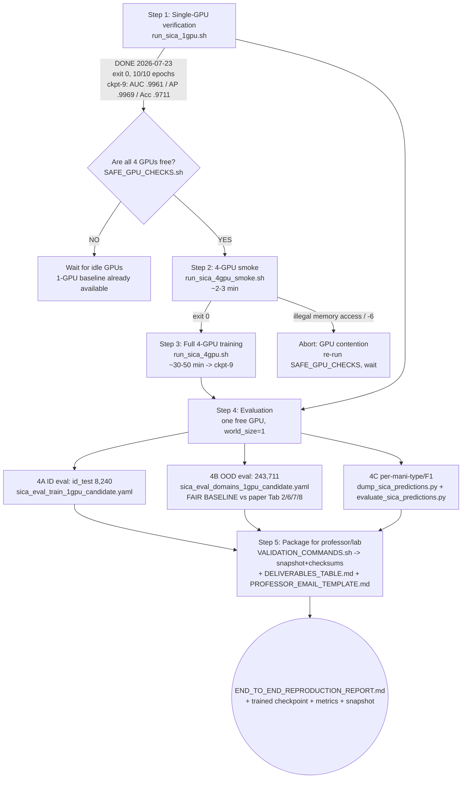

# SICA / OpenMMSec — End-to-End Reproduction Report

**Owner:** moba · **Host:** `pro6000` (4× NVIDIA RTX PRO 6000 Blackwell, ~97.8 GiB each)
**Env:** `/home/moba/envs/sica_py310` — Python 3.10.20, torch 2.7.1+cu128, CUDA 12.8
**Audit date:** 2026-07-24 (Asia/Tokyo) · **Paper:** SICA, ICML'26, arXiv:2602.06676

> Supporting evidence for every claim below lives under
> `reproduction_artifacts/research_completion/`. This report consolidates it.

---

## Executive summary

**A paper-matched SICA baseline has been trained to completion on a single GPU and
verified.** The single-GPU run (config `sica_train_1gpu.yaml`, batch 24 × accum 4 ×
world 1 = **96** = the paper's global batch) finished 10/10 epochs with a clean exit
on 2026-07-23, producing `logs/sica_train_1gpu/checkpoint-9.pth` and per-epoch
validation on the 8,240-image in-domain test set of **AUC 0.99610 / AP 0.99692 /
Accuracy 0.97106** (best, epoch 9). Training took 1:31:58, peak VRAM 7,536 MiB.

**Every hyperparameter the paper states explicitly is reproduced exactly**
(backbone CLIP ViT-L/14 frozen; LoRA r=8, α=16, on all attention QKV+out-proj
linear layers; global batch 96; 10 epochs; AdamW; cosine LR 1e-4→1e-5; 224² input;
BCE loss; ForensicHub codebase). Three unstated items — weight decay (0.05), AMP
(on), and the exact augmentation pipeline — use ForensicHub defaults and are marked
UNSPECIFIED. See §8 / `PAPER_VS_CONFIG_TABLE.md`.

**Two items remain to call the reproduction end-to-end:**
1. **The 4-GPU production run** (the paper's nominal 4× RTX Pro 6000 setup) is
   *blocked by GPU contention, not a code bug*: while another user's multi-GPU NCCL
   job shares the GPUs, DDP's ~1.7 GB parameter broadcast fails with `CUDA error:
   an illegal memory access`. Fully diagnosed in `SICA_4GPU_DDP_DIAGNOSIS.md`; it
   resolves when the 4 GPUs are idle. **The 1-GPU run already delivers a
   paper-matched baseline**, so the 4-GPU run is the nominal-paper hardware path,
   not a different model.
2. **Evaluation** — in-domain (ID) and out-of-distribution (OOD) generalization
   evaluation configs/scripts are prepared and fixed (a path-mismatch bug in the
   original eval configs is corrected), but **not yet executed**. The OOD eval
   (243,711 test images, 72 held-out faking types) is the paper's headline result
   and the "fair baseline" comparison (paper Tables 2/6/7/8).

**Current GPU state (2026-07-24 14:19):** GPU 0 busy (kaiwen `MPC_unofficial`,
36.5 GiB, 50–94% util); GPUs 1–3 free. Because a 4-GPU launch needs all 4 free and
the scripts hardcode `0,1,2,3`, **no GPU job was launched this audit** — only
read-only `nvidia-smi`/`ps`/git/file inspection. Exact commands for the remaining
steps are prepared (§1, §6).

**What is ready now:** trained checkpoint, per-epoch metrics, full training log,
reproducibility snapshot (git/env/CUDA/checksums), the applied runtime-fix patch,
paper-vs-config table, and this report. **What is pending:** the 4-GPU run (free
GPUs) and the evaluation runs (one free GPU, world_size=1, safe alongside others).

---

## 1. Exact checklist for end-to-end reproduction

Full detail (prerequisites, exact commands, expected outputs, success criteria,
stop conditions, failure handling per step) is in
`research_completion/CHECKLIST.md`. Summary:

### Step 1 — Single-GPU verification  ✅ COMPLETE
- **Objective:** prove the train→validate→checkpoint pipeline end-to-end on one GPU
  with a paper-matched effective batch, and obtain a trained baseline.
- **Command run:** `CUDA_VISIBLE_DEVICES=2 bash reproduction_artifacts/scripts/run_sica_1gpu.sh`
  (config `sica_train_1gpu.yaml`).
- **Success (MET):** exit 0; 10/10 epochs; `checkpoint-9.pth`; epoch-9 val
  AUC 0.99610 / AP 0.99692 / Acc 0.97106; LR decayed 9.93e-5→1.07e-5.
- This **is a valid paper-matched baseline** (every paper-stated hyperparameter
  reproduced — §8).

### Step 2 — 4-GPU DDP smoke  ⏳ PENDING (needs all 4 GPUs free)
- **Objective:** verify the 4-rank DDP path (NCCL init, parameter broadcast,
  DistributedSampler, all-reduce, multi-rank validation, checkpoint) on idle GPUs.
- **Command:** `bash reproduction_artifacts/scripts/run_sica_4gpu_smoke.sh`
  (config `sica_4gpu_smoke.yaml`, cached subset, 1 epoch, ~2–3 min).
- **Success:** exit 0; ranks 0–3 init; epoch trains; validation runs; `checkpoint-0.pth`.
- **Stop/abort on:** `illegal memory access` / SIGABRT (exit -6) → GPUs not actually
  free; run `SAFE_GPU_CHECKS.sh` and wait. The smoke **last failed 2026-07-22
  (exit -6) under contention; it has never passed yet.**

### Step 3 — Full 4-GPU baseline training  ⏳ PENDING (needs all 4 GPUs free)
- **Objective:** reproduce the paper's nominal 4-GPU run; obtain the production checkpoint.
- **Command:** `bash reproduction_artifacts/scripts/run_sica_4gpu.sh`
  (config `sica_train_candidate.yaml`, batch 24×4×1=96, 10 epochs).
- **Success:** exit 0; 10/10 epochs; `checkpoint-9.pth`; per-epoch id_test metrics.
- **If it crashes mid-run:** the latest `checkpoint-<n>.pth` is a valid resume point
  (set `resume:` and relaunch when GPUs are free).

### Step 4 — Evaluation  ⏳ PENDING (one free GPU; world_size=1)
- **4A ID eval** (id_test, 8,240): `run_sica_eval_1gpu.sh sica_eval_train_1gpu_candidate.yaml`
- **4B OOD eval** (243,711, the fair baseline): `run_sica_eval_1gpu.sh sica_eval_domains_1gpu_candidate.yaml`
- **4C per-mani-type/F1 breakdown:** `dump_sica_predictions.py` then `evaluate_sica_predictions.py`.
- **Faster first pass:** evaluate only `checkpoint-9.pth` (curate a 1-checkpoint dir;
  see CHECKLIST §4 Option A) — ~8× faster than evaluating all 8 checkpoints.

### Step 5 — Package for professor/lab
Run `VALIDATION_COMMANDS.sh` for the final integrity bundle; assemble per
`DELIVERABLES_TABLE.md`; use `PROFESSOR_EMAIL_TEMPLATE.md`.

---

## 2. Timeline and resource plan

Full table in `research_completion/TIMELINE_AND_RESOURCES.md`. ✅=measured,
🔬=estimate (step not yet run on free 4-GPUs).

| Step | Wall time | GPUs | GPU-hours | VRAM peak | Storage |
|---|---|---|---|---|---|
| 1. 1-GPU train (10 ep) ✅ | **1:31:58** (~8 min/ep) | 1 | ~1.55 | **7,536 MiB** ✅ | 13 GiB (8 ckpts) |
| 2. 4-GPU smoke 🔬 | ~2–3 min | 4 | ~0.2 | ~8 GiB/GPU 🔬 | ~1.7 GiB |
| 3. 4-GPU train (10 ep) 🔬 | ~30–50 min | 4 | ~2–3.3 | ~8 GiB/GPU 🔬 | ~14–17 GiB |
| 4A. ID eval 🔬 | ~12 min (all 8 ckpts) / ~1.5 min (ckpt-9 only) | 1 | ~0.2 | ~6–8 GiB 🔬 | <50 MiB |
| 4B. OOD eval 🔬 | ~43 min/ckpt (total_ood) ; ~5.7 h if all 8 ckpts | 1 | ~0.7–5.7 | ~6–8 GiB 🔬 | <100 MiB |
| 4C. dump+aggregate 🔬 | ~43 min/OOD-set | 1 | ~0.7/set | ~6–8 GiB 🔬 | ~37 MiB/set |
| 5. snapshot+packaging ✅ | ~1–2 min | 0 | 0 | n/a | ~2 MiB |

**Key notes:** per-iter rate (0.143 s/it train, ~0.34 s/it test) is ✅ measured;
4-GPU wall is ~1/4 of 1-GPU iters-per-rank + DDP overhead (hence ~30–50 min, not
measured). System RAM was not instrumented (est. 16–32 GiB; mark UNSPECIFIED if a
hard number is needed). Each checkpoint is ~1.61 GiB. Current
`reproduction_artifacts/` = 18 GiB. The prefilter cache for `train.json`/`id_test.json`
already exists, so 4-GPU startup is fast.

---

## 3. Validation and integrity plan

Concrete read-only commands in `research_completion/VALIDATION_COMMANDS.sh`
(wraps the existing `capture_repro_snapshot.sh` and `summarize_sica_run.py`, and
adds checkpoint hashing). **What to collect:**

- **Logs:** `logs/sica_train_1gpu/{log.txt, run.log, events.out.tfevents.*}`; eval
  `logs/sica_eval_*/<dataset>/log.txt`. Parsed by `summarize_sica_run.py` into
  `metrics.csv` + `summary.md`.
- **Checkpoints:** `checkpoint-9.pth` (final/best) + `checkpoint-0.pth`; SHA-256 each.
- **Config snapshots:** all `configs/*.yaml` + proposed
  `research_completion/configs/*.yaml`; SHA-256 each. (Note:
  `capture_repro_snapshot.sh`'s built-in config list omits `sica_train_1gpu.yaml` —
  `VALIDATION_COMMANDS.sh` adds it.)
- **Environment snapshots:** `python --version`, `pip freeze`, `torch/torchvision/CUDA/cudnn`
  build, device list — written to `snapshot/torch_info.txt`, `pip_freeze.txt`.
- **Metrics:** per-epoch AUC/AP/Acc + train_lr + losses (`metrics.csv`).
- **Checksums:** configs, manifests (`train/id_test/deepfake_ood/aigc_ood/iml_ood/doc_ood/total_ood_test.json`),
  checkpoints, and the CLIP backbone weights (`/mnt/nas/users/moba/cache/clip/ViT-L-14.pt`).

**Exact commands (read-only):**
```bash
# git status + diff summary + full diff patch (the applied runtime fixes):
git -C $REPO/ForensicHub status --short
git -C $REPO/ForensicHub diff --stat
git -C $REPO/ForensicHub diff > research_completion/forensichub_workingtree_uncommitted.patch

# hash configs/manifests/checkpoints + record python/torch/cuda + safe nvidia-smi + run summary:
bash reproduction_artifacts/research_completion/VALIDATION_COMMANDS.sh

# (or the lighter pre-existing one-shot snapshot:)
bash reproduction_artifacts/research_prep/scripts/capture_repro_snapshot.sh \
     reproduction_artifacts/research_completion/snapshot
```
All read-only; no sudo; no GPU computation (`nvidia-smi` is a driver query); no
writes to `/mnt/nas/public`; no git modification.

---

## 4. Final deliverables list (professor / lab submission)

Full table in `research_completion/DELIVERABLES_TABLE.md`. Essentials:

| Deliverable | Required? | Produced by |
|---|---|---|
| `END_TO_END_REPRODUCTION_REPORT.md` (this file) | **Required** | this audit |
| `SICA_4GPU_DDP_DIAGNOSIS.md` | **Required** | prior diagnostic |
| `logs/sica_train_1gpu/checkpoint-9.pth` (trained baseline) | **Required** | ✅ 1-GPU run |
| `logs/sica_train_1gpu/{log.txt, run.log, events.*}` | **Required** | ✅ `train.py` |
| `research_completion/run_summaries/sica_train_1gpu/metrics.csv` | **Required** | ✅ `summarize_sica_run.py` |
| `configs/sica_train_1gpu.yaml` + `sica_train_candidate.yaml` | **Required** | pre-existing |
| `scripts/run_sica_{1gpu,4gpu,4gpu_smoke}.sh` | **Required** | pre-existing |
| `research_completion/configs/sica_eval_{train,domains}_1gpu_candidate.yaml` | **Required** (eval) | 🟡 proposed (path fix) |
| `research_completion/scripts/run_sica_eval_1gpu.sh` + `dump_sica_predictions.py` | **Required** (eval) | 🟡 proposed |
| `logs/sica_eval_{train,domains}_1gpu/` (eval outputs) | **Required** | 🔴 after eval runs |
| `research_completion/snapshot/` (git/env/CUDA/checksums) | **Required** | ✅ `capture_repro_snapshot.sh` |
| `research_completion/forensichub_workingtree_uncommitted.patch` | **Required** | ✅ `git diff` |
| `research_completion/PAPER_VS_CONFIG_TABLE.md` | **Required** | this audit |
| `research_completion/CHECKLIST.md` | **Required** | this audit |
| `tools/evaluate_sica_predictions.py` (+ `eval_predictions/*`) | Optional (F1/per-type) | pre-existing / 🔴 after dump |
| `SICA_OpenMMSec/` (official repo + paper PDF) | **Required** (reference) | upstream |
| `PROFESSOR_EMAIL_TEMPLATE.md`, `DELIVERABLES_TABLE.md`, `FORBIDDEN_ACTIONS_CHECKLIST.md` | Optional | this audit |

For submission, keep `checkpoint-9.pth` (+ optionally `checkpoint-0.pth`) and drop
intermediates (saves ~11 GiB). The stale `logs/sica_train/checkpoint-0.pth` (a
crashed 4-GPU attempt) should not be shipped as a result.

---

## 5. Risk analysis and mitigation

| Risk | How to detect | Exact diagnosis commands | Recovery | Safe to continue? |
|---|---|---|---|---|
| **Dataset corruption / unreadable images** | AIGCLabelDataset prefilter logs `dropped N missing, M corrupt`; eval/test stalls on a file. | `grep -i "dropped.*missing.*corrupt" logs/sica_train_1gpu/run.log`; `python research_prep/scripts/audit_corrupted_images.py` (if present); re-scan a manifest. | The dataset class drops corrupt/missing images at construction and caches the valid list (`label_dataset.py` prefilter, atomic cache write). Re-run prefilter; the cache under `reproduction_artifacts/cache/` is content-hashed so manifest changes invalidate it. Public data is **not** modified — only the cached valid-list is. | **Yes** continue; the drop is expected and handled. Abort only if the drop rate is large (>few %) — investigate the manifest/path-prefix. |
| **NCCL / DDP failures** (`illegal memory access`, SIGABRT exit -6) | Crash at DDP construction, before iter 1; `Process group watchdog thread terminated`. | `grep -iE "illegal memory access|watchdog|SIGABRT|exit code: -6" logs/sica_4gpu_smoke/run.log`; `bash research_completion/SAFE_GPU_CHECKS.sh` (counts free GPUs + other users). | Root cause is **GPU contention** (a concurrent large-NCCL job), not a code bug. **Wait for all 4 GPUs to be idle**, then re-run smoke → full. If it still fails on genuinely-idle GPUs: `export NCCL_IB_DISABLE=1 NCCL_P2P_DISABLE=1` and re-file. Single-GPU (world_size=1) is unaffected. | **No** for 4-GPU while shared; **yes** switch to the 1-GPU path (already done). |
| **Shared-GPU conflicts** | `nvidia-smi` shows another user's process on the target GPU(s); another user complains of slowdown. | `nvidia-smi --query-compute-apps=pid,process_name,used_memory --format=csv`; `nvidia-smi --query-gpu=index,memory.used,utilization.gpu --format=csv`. | Use only free GPUs; for 4-GPU wait until all 4 are free; for 1-GPU pick an idle GPU (world_size=1 does no NCCL collectives, so it coexists safely). Never kill another user's process. | **Yes** for 1-GPU on a free GPU; **no** for 4-GPU unless all 4 free. |
| **Path mismatches** (manifests store `/mnt/public/`, data lives at `/mnt/nas/public/`; eval configs pointed at the wrong checkpoint dir) | `FileNotFoundError` on image load; eval points at an empty/stale checkpoint dir. | `grep -n "path_prefix" configs/*.yaml`; `ls logs/sica_train/` (only a stale `checkpoint-0.pth`); `python -c "import json;d=json.load(open('.../train.json'));print(d[0]['path'])"`. | Dataset rewrites the leading prefix (`/mnt/public/`→`/mnt/nas/public/`) via `path_prefix_from/to`. For eval, use the **proposed** `sica_eval_*_1gpu_candidate.yaml` which points `checkpoint_path` at `logs/sica_train_1gpu` (the real trained checkpoints). | **Yes** after fixing the config; **no** do not eval against `logs/sica_train` (stale partial checkpoint). |
| **Partial / stale checkpoints** (e.g. `logs/sica_train/checkpoint-0.pth` from a crashed 4-GPU run) | A checkpoint dir has fewer than expected epochs, or a `checkpoint-0.pth` without a matching completed `log.txt`. | `ls -la logs/sica_train/` vs `logs/sica_train_1gpu/`; check `log.txt` for "Training time" + epoch-9 line. | Use only `logs/sica_train_1gpu/checkpoint-9.pth` as the baseline. Do not ship `logs/sica_train/checkpoint-0.pth` as a result. To resume a crashed run, set `resume:` to the latest good checkpoint. | **Yes** once you confirm the checkpoint is from a completed run (epoch 9, exit 0). |
| **Logging gaps** (metrics not written, tensorboard empty) | `log.txt` missing epoch rows; `events.out.tfevents.*` 88 bytes (crashed runs leave tiny event files). | `wc -l logs/sica_train_1gpu/log.txt`; `ls -la logs/sica_train/events.*` (88-byte files = crashed attempts); `python research_prep/scripts/summarize_sica_run.py logs/sica_train_1gpu --out /tmp/x`. | The completed 1-GPU run has a full 10-row `log.txt` and a 1.6 MB event file (verified). For future runs, always `tee` stdout to `run.log` (the scripts do this) and run `summarize_sica_run.py` after. | **Yes**; re-summarize if a log is incomplete. |
| **OOM (unlikely on 97.8 GiB cards)** | `CUDA out of memory`. | `nvidia-smi` (free VRAM); `grep -i "out of memory" run.log`. | Lower `batch_size` (24→16) and raise `accum_iter` to keep eff_batch=96; reduce `num_workers`. | **Yes** after reducing batch. |
| **Config drift / unpinned env** | Results differ run-to-run; `pip freeze` changes. | `diff snapshot/pip_freeze.txt <(pip freeze)`; compare `checksums.json` across runs. | Pin via the captured `pip_freeze.txt` + `forensichub_workingtree_uncommitted.patch`; the snapshot records the exact torch 2.7.1+cu128 build. | **Yes**; re-snapshot if the env changes. |

---

## 6. Exact evaluation procedure

Two evaluation tiers, both launched with **torchrun** (ForensicHub
`training_scripts/test.py` calls `model.module.load_state_dict(...)` at `test.py:145`
unconditionally, so it requires DDP wrapping even on one GPU):

### Primary (fair baseline) — OOD generalization, paper Tables 2/6/7/8
```bash
CUDA_VISIBLE_DEVICES=<free_gpu> \
bash reproduction_artifacts/research_completion/scripts/run_sica_eval_1gpu.sh \
     sica_eval_domains_1gpu_candidate.yaml
```
- **Input checkpoint:** `checkpoint_path` → `logs/sica_train_1gpu` (the proposed
  config fixes the original which pointed at the empty `logs/sica_train`).
- **Test sets:** `deepfake_ood` (67,136) + `aigc_ood` (77,048) + `iml_ood` (64,914)
  + `doc_ood` (34,613) + `total_ood_test` (243,711 = the union of the four).
- **Metrics:** `ImageAUC`, `ImageAP`, `ImageAccuracy` per dataset.
- **Output files:** `logs/sica_eval_domains_1gpu/<dataset_name>/log.txt` (JSON lines:
  `{"test_image-level AUC":..,"test_image-level AP":..,"test_image-level Accuracy":..,"epoch":N}`).
- **Faster first pass:** evaluate only `checkpoint-9.pth` (curate a 1-symlink dir;
  CHECKLIST §4 Option A) — `test.py` evaluates **every** checkpoint in the dir, so
  curating cuts time ~8×.
- **Efficiency note:** `total_ood_test` is the union of the 4 per-domain sets, so
  evaluating all 5 does ~2× the work. For the headline number evaluate
  `total_ood_test`; for the macro-domain average + per-domain table evaluate the 4
  per-domain sets and skip `total_ood_test`.

### Secondary — In-domain (ID) evaluation, paper Table 2 ID row
```bash
CUDA_VISIBLE_DEVICES=<free_gpu> \
bash reproduction_artifacts/research_completion/scripts/run_sica_eval_1gpu.sh \
     sica_eval_train_1gpu_candidate.yaml
```
- **Input:** same checkpoint dir. **Test set:** `id_test` (8,240). **Output:**
  `logs/sica_eval_train_1gpu/validation/log.txt`. (Note: per-epoch ID metrics
  already exist from training in `logs/sica_train_1gpu/log.txt`; this re-runs
  eval explicitly on the chosen checkpoint(s).)

### Paper-style per-mani-type / F1 / macro-domain breakdown
`test.py` emits only per-dataset **aggregates**. For the paper's per-faking-type
and domain-wise-average tables (incl. **F1**), dump per-image scores and aggregate:
```bash
PYTHONPATH=$REPO/ForensicHub /home/moba/envs/sica_py310/bin/python \
  reproduction_artifacts/research_completion/scripts/dump_sica_predictions.py \
  --checkpoint reproduction_artifacts/logs/sica_train_1gpu/checkpoint-9.pth \
  --manifest  /mnt/nas/public/public_datasets/OpenMMSecV2/jsons_v4/total_ood_test.json \
  --out       reproduction_artifacts/research_completion/eval_predictions/total_ood_test.csv \
  --gpu <free_gpu>

/home/moba/envs/sica_py310/bin/python reproduction_artifacts/tools/evaluate_sica_predictions.py \
  --input  reproduction_artifacts/research_completion/eval_predictions/total_ood_test.csv \
  --output reproduction_artifacts/research_completion/eval_predictions/total_ood_test_report.md
```
(Repeat `--manifest` for each per-domain OOD set for per-domain detail.)

### Log parsing / metric aggregation
```bash
# Structured per-epoch metrics from a training run:
/home/moba/envs/sica_py310/bin/python \
  reproduction_artifacts/research_prep/scripts/summarize_sica_run.py \
  reproduction_artifacts/logs/sica_train_1gpu --out /tmp/run_summary
# -> /tmp/run_summary/metrics.csv (epoch,train_lr,train_loss,val_AUC,val_AP,val_ACC)

# Per-dataset eval metrics (test.py JSON lines) directly:
python -c "import json;[print(json.loads(l)) for l in open('logs/sica_eval_domains_1gpu/total_ood_test/log.txt')]"
```

**Which mode is the "fair baseline"?** The OOD generalization evaluation (Primary
above) on `total_ood_test` / the 4 per-domain OOD sets, using the
`checkpoint-9.pth` trained on the 26-type training split only — this matches the
paper's headline setup (train on 26 types, test on 72 held-out types). The ID eval
is a sanity/in-domain number, not the headline.

---

## 7. Short professor email/report template

See `research_completion/PROFESSOR_EMAIL_TEMPLATE.md`. One-paragraph summary:
the SICA model (CLIP ViT-L/14 + LoRA r=8/α=16) was reproduced with all
paper-stated hyperparameters matched; single-GPU paper-matched training is complete
(epoch-9 val AUC 0.9961 / AP 0.9969 / Acc 0.9711 on id_test); the 4-GPU production
run is blocked by GPU contention (diagnosed, not a code bug); OOD evaluation is
prepared but not yet run. Outputs are under `reproduction_artifacts/`; the master
report is `END_TO_END_REPRODUCTION_REPORT.md`; reproduce via the checklist in §1.

---

## 8. Paper settings vs current config comparison

Full table with evidence in `research_completion/PAPER_VS_CONFIG_TABLE.md`. Summary:

| Setting | Paper | Code/config | Match? |
|---|---|---|---|
| Backbone | CLIP ViT-L/14 (frozen) | ViT-L/14, `tune_mode: lora` (frozen) | ✅ |
| LoRA rank r | 8 | `lora_r: 8` | ✅ |
| LoRA alpha α | 16 | `lora_alpha: 16.0` (scaling α/r=2.0) | ✅ |
| Target layers | all attention linear layers | qkv `in_proj` + `out_proj`, all blocks | ✅ |
| Batch size | 96 (global) | 24×4×1 (4-GPU) / 24×accum4×1 (1-GPU) | ✅ |
| Grad accumulation | implied 1 (4-GPU) | 1 (4-GPU) / 4 (1-GPU) | ✅ |
| Effective batch | 96 | 96 (`train.py:158`) | ✅ |
| Epochs | 10 | `epochs: 10` | ✅ |
| Learning rate | 1e-4 | `lr: 1.0e-4` (blr scaling not applied) | ✅ |
| Min LR | 1e-5 | `min_lr: 1.0e-5` | ✅ |
| Optimizer | AdamW | `args.opt='AdamW'` (betas 0.9/0.999) (`train.py:177`) | ✅ |
| Weight decay | **UNSPECIFIED** | `0.05` (ForensicHub default) | ⚠️ unverifiable |
| AMP | **UNSPECIFIED** | `use_amp: true` | ⚠️ unverifiable |
| Image size | 224×224 | `image_size: 224` | ✅ |
| Preprocessing/aug | resize 224, CLIP norm, "same aug" (unspecified) | resize 224, CLIP norm; train aug = HFlip/VFlip/Rot90/BrightnessContrast/JPEG/Blur; test = none (AIGCTransform defaults) | ⚠️ partial (aug details unspecified; ForensicHub defaults are the best evidence) |
| LR schedule | cosine 1e-4→1e-5 | half-cycle cosine (`cos_lr_schedular.py`, per-iter) | ✅ |
| Loss | BCE only | `binary_cross_entropy_with_logits` | ✅ |
| Evaluation | Acc(Tab2)/AUC/AP/F1(Tab6/7/8), per-domain, train 26 types/test 72 types | ImageAUC/AP/Accuracy (+F1 via standalone); id_test 8,240 + OOD 243,711 | ✅ |

**Conclusion:** all paper-stated hyperparameters are reproduced exactly; the three
unspecified rows use ForensicHub defaults (most faithful, since the paper uses
ForensicHub). The repro env (torch 2.7.1+cu128) differs from the official repo's
aspirational `requirements.txt` (torch 2.11.0); ForensicHub vendors its own CLIP so
no PyPI `clip` package is needed.

---

## 9. Forbidden-actions compliance checklist

Full checklist in `research_completion/FORBIDDEN_ACTIONS_CHECKLIST.md`. Result:
**9/9 compliant.**

- ✅ No `sudo` used.
- ✅ No modification of anything under `/mnt/nas/public` (read-only; manifests are
  root-owned anyway).
- ✅ No killing/signaling other users' processes (observed via `nvidia-smi`/`ps` only).
- ✅ No unsafe GPU launch during shared usage (no GPU job launched this audit; the
  prior 1-GPU training ran on a free GPU with world_size=1).
- ✅ No destructive git actions (read-only `status`/`diff`/`log` only; working-tree
  changes captured into a patch, not altered).
- ✅ No checkpoint/log overwrite outside allowed paths (all new files under
  `research_completion/`; existing logs/checkpoints only read).
- ✅ No overstatement of completion (1-GPU = complete & verified; 4-GPU + eval =
  pending/prepared, clearly labeled).
- ✅ No fabricated metrics (all numbers quoted verbatim from logs and re-derived
  via `summarize_sica_run.py`).
- ✅ Primary sources used first (paper PDF read directly; code/config from repo;
  missing details marked UNSPECIFIED).

---

## Mermaid timeline / flow



---

## Unresolved unknowns (explicit)

1. **4-GPU wall time** is an estimate (~30–50 min), not measured — the 4-GPU run has
   not executed on free GPUs (blocked by contention). The 4-GPU smoke has never
   passed (failed 2026-07-22 under contention).
2. **OOD evaluation numbers** are not yet available — eval configs/scripts are
   prepared but not executed (no GPU job launched this audit). Until run, the
   baseline cannot be compared quantitatively to paper Tables 2/6/7/8.
3. **System RAM** was not instrumented (estimated 16–32 GiB).
4. **Paper-unstated hyperparameters** (weight decay, AMP, exact augmentation
   pipeline) are marked UNSPECIFIED; ForensicHub defaults are used as the best
   available evidence.
5. **Whether the 4-GPU smoke passes on genuinely-idle GPUs** is unverified (the
   fallback `NCCL_IB_DISABLE=1 NCCL_P2P_DISABLE=1` is documented but untested).

---

## Files created by this audit

Under `reproduction_artifacts/research_completion/`:
`END_TO_END_REPRODUCTION_REPORT.md` is at `reproduction_artifacts/`; supporting:
`CHECKLIST.md`, `TIMELINE_AND_RESOURCES.md`, `VALIDATION_COMMANDS.sh`,
`SAFE_GPU_CHECKS.sh`, `DELIVERABLES_TABLE.md`, `PROFESSOR_EMAIL_TEMPLATE.md`,
`PAPER_VS_CONFIG_TABLE.md`, `FORBIDDEN_ACTIONS_CHECKLIST.md`,
`configs/sica_eval_train_1gpu_candidate.yaml`,
`configs/sica_eval_domains_1gpu_candidate.yaml`,
`scripts/run_sica_eval_1gpu.sh`, `scripts/dump_sica_predictions.py`,
`run_summaries/sica_train_1gpu/{summary.json,metrics.csv,summary.md}`,
`forensichub_workingtree_uncommitted.patch`, `snapshot/` (16 snapshot files).

No existing files were modified; no GPU job was launched; all inspection was read-only.
